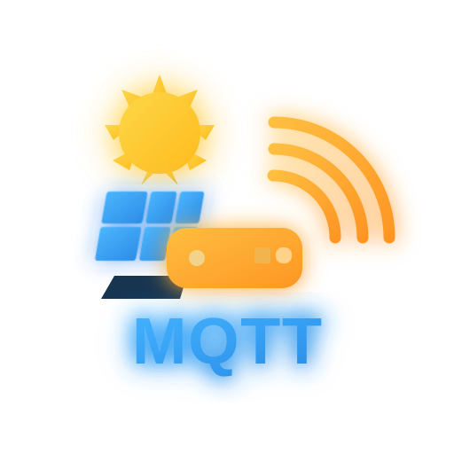

# Enphase Envoy MQTT for Unraid



Unraid Community Applications wrapper for
[Enphase-Envoy-mqtt-json](https://github.com/vk2him/Enphase-Envoy-mqtt-json)
by [vk2him](https://github.com/vk2him).

This project provides an Unraid-friendly configuration and packaging layer around
the upstream Docker image, allowing real-time data from an **Enphase Envoy**
gateway to be published to any MQTT broker.

It also includes optional examples for integrating Enphase production and grid
metering data with **Victron Cerbo GX / Venus OS** using MQTT and Node-RED.

> This is an independent community project and is not affiliated with or
> endorsed by Enphase Energy, Victron Energy, or Lime Technology / Unraid.

---

## Features

- Native Unraid Docker template
- Published Docker image on GitHub Container Registry (GHCR)
- Reads real-time metering data from an Enphase Envoy
- Publishes the Envoy JSON data to any MQTT broker
- Supports authenticated and anonymous MQTT brokers
- Persistent Enphase authentication token
- Automatically generates the upstream `options.json` configuration from
  Unraid environment variables
- Enphase credentials and authentication tokens are redacted from application logs
- No Web UI or inbound ports required
- Optional Victron Cerbo GX / Venus OS integration
- Optional Node-RED examples for creating Victron virtual Grid and PV meters

---

## Architecture

The container is designed to remain MQTT-broker agnostic.

A basic installation looks like this:

```text
Enphase Envoy
      │
      │ HTTPS
      ▼
Enphase Envoy MQTT
Docker container on Unraid
      │
      │ MQTT
      ▼
Any MQTT Broker
```

The setup used during development and testing was:

```text
Enphase Envoy-S Metered
        │
        │ HTTPS
        ▼
Unraid
Enphase Envoy MQTT container
        │
        │ MQTT
        ▼
Victron Cerbo GX MK2
MQTT Broker / Venus OS
        │
        ▼
Node-RED
        │
        ├──► Virtual Grid Meter
        │
        └──► Virtual PV Inverter
                 │
                 ▼
        Victron Energy System
        MultiPlus-II 48V / 5000VA / 70A
```

---

## Tested Hardware

This project has been tested in a real installation using:

- **Victron MultiPlus-II 48V - 5000VA - 70A**
- **Victron Energy Cerbo GX MK2 Controller**
- **Enphase Envoy-S Metered**
- **Unraid**

The tested Envoy was running Enphase **D8 firmware**.

In this setup, the MQTT broker runs on the **Cerbo GX** and the Enphase data is
processed with **Node-RED** before being exposed to Venus OS as virtual Grid and
PV meters.

### Important

The Victron hardware above is **not required**.

You can use this container with any MQTT broker reachable from the Unraid server,
including Mosquitto, EMQX, Home Assistant MQTT, a remote MQTT server, or another
device running an MQTT broker.

---

## Upstream Project

All Enphase communication, Envoy polling, firmware handling, metering data
collection, and MQTT publishing functionality is provided by:

**Enphase-Envoy-mqtt-json**  
https://github.com/vk2him/Enphase-Envoy-mqtt-json

This repository does **not** reimplement the upstream project.

Instead, it adds an Unraid-specific wrapper that:

1. receives configuration through Docker environment variables;
2. generates `/app/data/options.json`;
3. stores authentication data persistently in `/app/data`;
4. starts the upstream application;
5. filters sensitive authentication tokens and passwords from its output.

The Docker image in this repository is built on top of the upstream image:

```dockerfile
FROM ghcr.io/vk2him/enphase-envoy-mqtt-json:latest
```

Please consider supporting and contributing to the upstream project.

---

## Docker Image

The image is published to GitHub Container Registry:

```text
ghcr.io/joaogalaghar/enphase-envoy-mqtt-unraid:latest
```

The image is automatically built from this repository using GitHub Actions.

---

## Unraid Installation

The application is designed for installation through **Unraid Community
Applications**.

Until the application is publicly listed in Community Applications, the template
can also be loaded manually from:

```text
https://raw.githubusercontent.com/joaogalaghar/enphase-envoy-mqtt-unraid/main/templates/enphase-envoy-mqtt.xml
```

The container does not expose a Web UI and does not require any inbound Docker
ports.

It only needs network access to:

- the Enphase Envoy;
- the configured MQTT broker;
- Enphase authentication services when a new authentication token is required.

---

## Configuration

### Persistent Appdata

Container path:

```text
/app/data
```

Recommended Unraid path:

```text
/mnt/user/appdata/enphase-envoy-mqtt-unraid
```

This directory stores:

```text
options.json
token.txt
```

The Enphase token therefore survives Docker container updates and recreation.

---

## Environment Variables

| Variable | Required | Default | Description |
|---|---|---|---|
| `MQTT_HOST` | Yes | — | MQTT broker hostname or IP address |
| `MQTT_PORT` | Yes | `1883` | MQTT broker port |
| `MQTT_USER` | No | — | MQTT username |
| `MQTT_PASSWORD` | No | — | MQTT password |
| `MQTT_TOPIC` | Yes | `envoy/json` | MQTT topic used to publish Envoy JSON |
| `ENVOY_HOST` | Yes | — | Enphase Envoy hostname or IP address |
| `ENVOY_USER` | Firmware dependent | — | Enphase account email, required by modern firmware |
| `ENVOY_USER_PASS` | Firmware dependent | — | Enphase account password used to obtain an authentication token |
| `ENVOY_USE_HTTPS` | Yes | `true` | Connect to the Envoy using HTTPS |
| `USE_FREEDS` | No | `false` | Enable upstream FREEDS support |
| `BATTERY_INSTALLED` | No | `false` | Enable upstream Enphase battery support |
| `DEBUG` | No | `false` | Enable upstream debugging |

For recent Enphase firmware such as **D7/D8**, your Enphase account credentials
are normally required to obtain the Envoy authentication token.

---

## MQTT Example

A typical configuration might use:

```text
MQTT_HOST=192.168.1.50
MQTT_PORT=1883
MQTT_TOPIC=envoy/json

ENVOY_HOST=192.168.1.100
ENVOY_USE_HTTPS=true
```

MQTT authentication can be left empty when the broker allows anonymous
connections.

You can verify that data is arriving using Mosquitto:

```bash
mosquitto_sub \
  -h 192.168.1.50 \
  -p 1883 \
  -t 'envoy/json' \
  -v
```

The payload published by the upstream application contains the raw JSON metering
information retrieved from the Envoy.

---

## Victron Cerbo GX / Venus OS Integration

Victron integration is optional and is **not required for normal operation**.

The tested configuration uses the MQTT broker available on the Cerbo GX:

```text
Envoy-S Metered
      │
      ▼
Unraid Docker
      │
      │ MQTT
      ▼
Cerbo GX
      │
      ▼
Node-RED
      │
      ├── Grid values
      └── PV production values
```

Node-RED can then transform the relevant Enphase measurements into the MQTT
messages expected by Venus OS virtual devices.

Example flows and additional documentation will be available under:

```text
examples/victron-cerbo-gx/
```

---

## Authentication Token

Modern Enphase Envoy firmware uses token-based authentication.

On the first startup, when no token exists, the upstream application obtains a
token using the configured Enphase account credentials.

The wrapper stores it at:

```text
/app/data/token.txt
```

On subsequent container starts the existing token is reused.

Example startup:

```text
[wrapper] Existing Enphase token: yes
Detected Firmware version D8
Read token from file data/token.txt : [REDACTED]
Connected to mqtt-broker:1883
Subscribed to MQTT_TOPIC: envoy/json
```

Authentication tokens are filtered from the container logs by this wrapper.

---

## Security Notes

### Enphase Credentials

Your Enphase email and password are passed to the Docker container as environment
variables because they are required by the upstream application for modern Envoy
authentication.

The password field is masked in the Unraid template UI.

However, depending on the Unraid version and Docker Manager view, environment
variables may still be visible in generated Docker commands or container
inspection output.

Do not publish screenshots or diagnostics containing credentials.

### Tokens

`token.txt` contains an Enphase authentication token and should be treated as
sensitive data.

Do not publish:

```text
token.txt
options.json
```

or unredacted diagnostic logs.

The wrapper sets restrictive permissions on these files where possible and
redacts detected Enphase JWT tokens from application output.

---

## Logs

View the container logs from the Unraid Docker page or with:

```bash
docker logs -f enphase-envoy-mqtt-unraid
```

A successful startup should look similar to:

```text
[wrapper] Enphase Envoy MQTT for Unraid
[wrapper] Configuration written to /app/data/options.json
[wrapper] MQTT: mqtt-broker:1883 topic=envoy/json
[wrapper] Envoy: https://envoy.local
[wrapper] Existing Enphase token: yes

Detected Firmware version D8
Read token from file data/token.txt : [REDACTED]
Connected to mqtt-broker:1883
Subscribed to MQTT_TOPIC: envoy/json
```

---

## Troubleshooting

### Cannot connect to MQTT

Check that the MQTT broker is reachable from the Unraid server and confirm:

```text
MQTT_HOST
MQTT_PORT
MQTT_USER
MQTT_PASSWORD
```

If the broker does not require authentication, leave `MQTT_USER` and
`MQTT_PASSWORD` empty.

### Envoy authentication fails

For D7/D8 firmware, confirm that:

```text
ENVOY_USER
ENVOY_USER_PASS
```

contain your **Enphase account email and account password**.

`ENVOY_USER_PASS` must not contain an authentication JWT token.

### Force a new Enphase token

Stop the container and remove:

```text
/mnt/user/appdata/enphase-envoy-mqtt-unraid/token.txt
```

The next startup will request a new token.

Do this only when authentication troubleshooting requires it.

### MQTT works but there is no Victron data

Publishing Enphase JSON to MQTT and creating Victron virtual devices are two
separate steps.

Confirm first that the raw MQTT topic contains Enphase data.

The optional Node-RED / Venus OS integration is responsible for converting the
relevant measurements into Victron virtual meter values.

---

## Updating

The Unraid application uses:

```text
ghcr.io/joaogalaghar/enphase-envoy-mqtt-unraid:latest
```

Updating the Docker image does not remove the persistent appdata directory.

Therefore the existing:

```text
options.json
token.txt
```

remain available after a normal container update or recreation.

The wrapper regenerates `options.json` from the current Unraid configuration each
time the container starts.

---

## Repository Structure

```text
enphase-envoy-mqtt-unraid/
├── .github/
│   └── workflows/
│       └── docker.yml
├── examples/
│   └── victron-cerbo-gx/
├── templates/
│   └── enphase-envoy-mqtt.xml
├── Dockerfile
├── entrypoint.py
├── icon.png
├── icon.svg
├── ca_profile.xml
├── THIRD_PARTY_NOTICES.md
├── LICENSE
└── README.md
```

---

## Community Applications

The repository and Docker template have been tested with the official Unraid
Community Applications repository scanner.

The scanner successfully detected:

- a valid Docker application;
- the Community Applications repository profile;
- a pullable Docker image;
- valid template metadata;
- no template warnings.

---

## License

This wrapper repository is distributed under the **MIT License**.

See:

```text
LICENSE
```

for details.

Third-party software remains subject to its respective license.

See:

```text
THIRD_PARTY_NOTICES.md
```

for upstream attribution.

---

## Credits

This project would not exist without:

### Enphase-Envoy-mqtt-json

Created and maintained by **vk2him**:

https://github.com/vk2him/Enphase-Envoy-mqtt-json

All Envoy communication and MQTT publishing functionality comes from that
project.

### Unraid

This repository provides the packaging and template required to make the upstream
project easy to configure and run on Unraid.

### Victron Energy

Victron Cerbo GX / Venus OS integration documented in this repository is an
optional community integration built using MQTT and Node-RED.

---

## Support

For issues related specifically to the **Unraid wrapper, Docker image, template,
or Victron examples**, please use:

https://github.com/joaogalaghar/enphase-envoy-mqtt-unraid/issues

For issues related to **Envoy communication or the upstream MQTT application**,
please check the upstream project first:

https://github.com/vk2him/Enphase-Envoy-mqtt-json/issues
